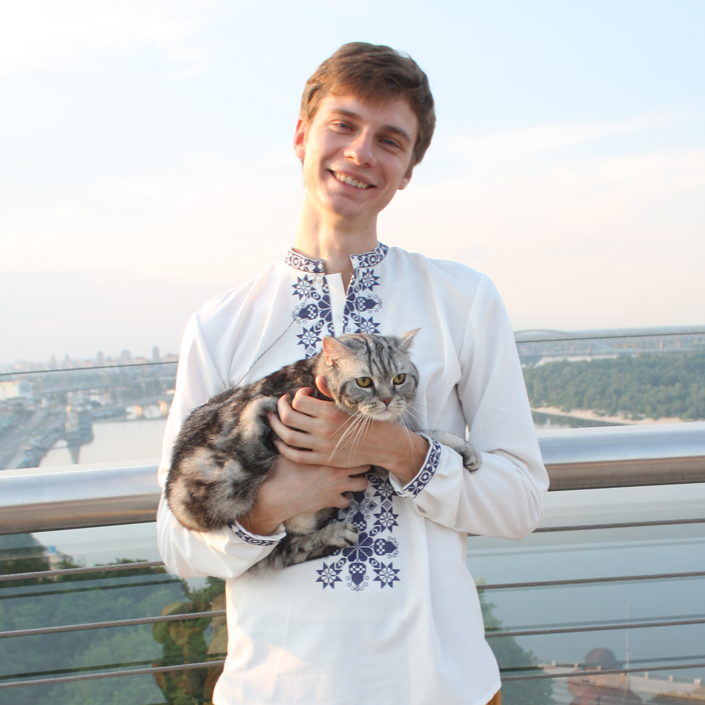

---
# Feel free to add content and custom Front Matter to this file.
# To modify the layout, see https://jekyllrb.com/docs/themes/#overriding-theme-defaults

layout: page
title:  Home
permalink: /
---

<link rel="stylesheet" href="{{ '/assets/css/custom.css' | relative_url }}">

{: style="float:right; width:300px; border-radius:12px; margin:0 0 1em 1em;"}

Hi! 👋

I’m a computer science researcher specialising in AI and machine learning, with a focus on natural language processing and mathematical reasoning. I am currently a visiting postgraduate research student at the University of Cambridge, UK, working with [Professor Simone Teufel](https://scholar.google.co.uk/citations?user=GnKIYCcAAAAJ) and Dr. Yiannos Stathopoulos. My research explores the use of language models for mathematical data generation and problem synthesis.

I’m a Ph.D. candidate at Taras Shevchenko National University of Kyiv (KNU), where I work under the supervision of [Professor Anatoly Anisimov](https://scholar.google.com.ua/citations?user=WRxJxC0AAAAJ). I received my B.Sc. and M.Sc. (with honours) in Computer Science from KNU in 2018 and 2020, respectively.

Outside academia, I'm passionate about STEM education for younger learners. I’ve taught and coordinated several initiatives, including Kontora Pi, PIT School, and Mathematical Olymp. I’m also the co-founder and director of Kvanta, a STEM project for schoolchildren.
