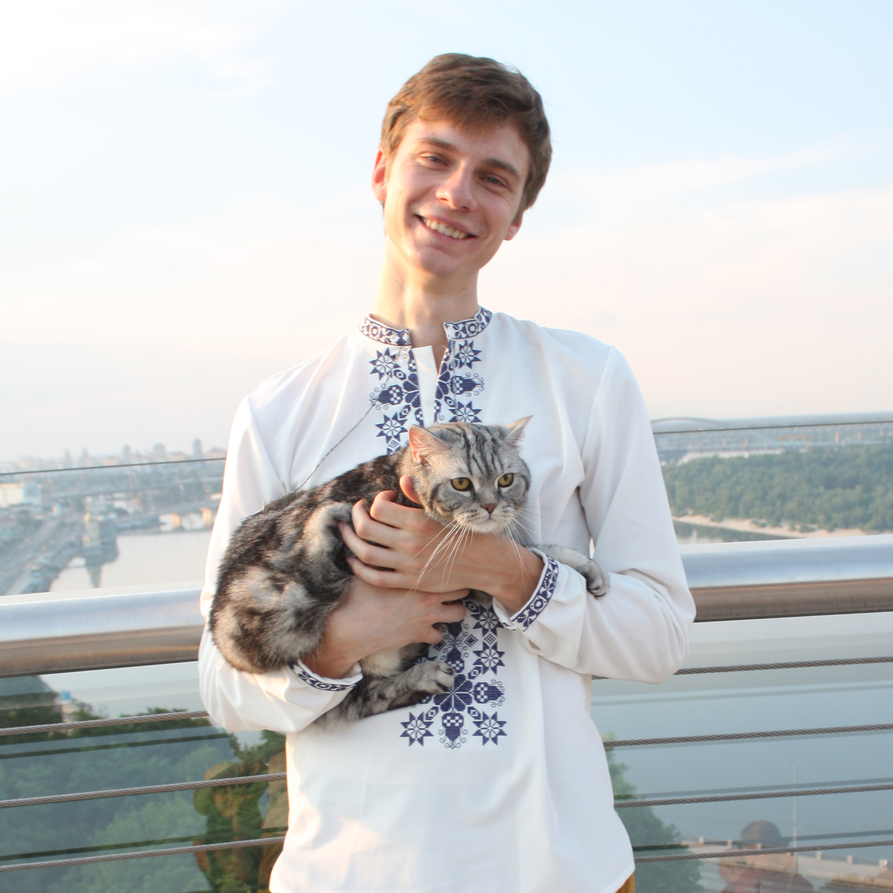

---
# Feel free to add content and custom Front Matter to this file.
# To modify the layout, see https://jekyllrb.com/docs/themes/#overriding-theme-defaults

layout: page
title:  Home
permalink: /
---

<link rel="stylesheet" href="{{ '/assets/css/custom.css' | relative_url }}">

{: style="float:right; width:300px; border-radius:12px; margin:0 0 1em 1em;"}

Hi! 👋

I'm a visiting researcher at the [University of Cambridge](https://www.cst.cam.ac.uk/), working with [Prof. Simone Teufel](https://www.cl.cam.ac.uk/~sht25/) and [Dr. Yiannos Stathopoulos](https://www.cl.cam.ac.uk/~yas23/) in the Cambridge NLIP Group. I have recently completed Ph.D. in Computer Science at [Taras Shevchenko National University of Kyiv](https://knu.ua/en/), supervised by [Prof. Anatoly Anisimov](https://dblp.org/pid/72/5294.html). Prior to that, I obtained my B.Sc. and M.Sc. degrees, both in Computer Science, focusing on deep learning and cloud computing.

My research focuses on reasoning with LLMs (mathematical/abstract reasoning), synthetic data generation and agentic AI. You can find my research contributions at the [/research](/research) page.

Beyond academia, I’m passionate about STEM education for young learners. I’ve taught programming and mathematical olympiad training in schools and summer boot camps, served as a jury member on mathematical competitions, and coordinated educational programs including _NGO Kontora Pi_, _PIT School_, _Mathematical Olymp_. I’m also a co-founder and director of _Kvanta_, an educational STEM project for schoolchildren. You can learn more about my STEM projects on the [/stem-projects](/stem-projects) page.

You can find my resume [here](/cv). Please, feel free to email me. I am happy to connect!